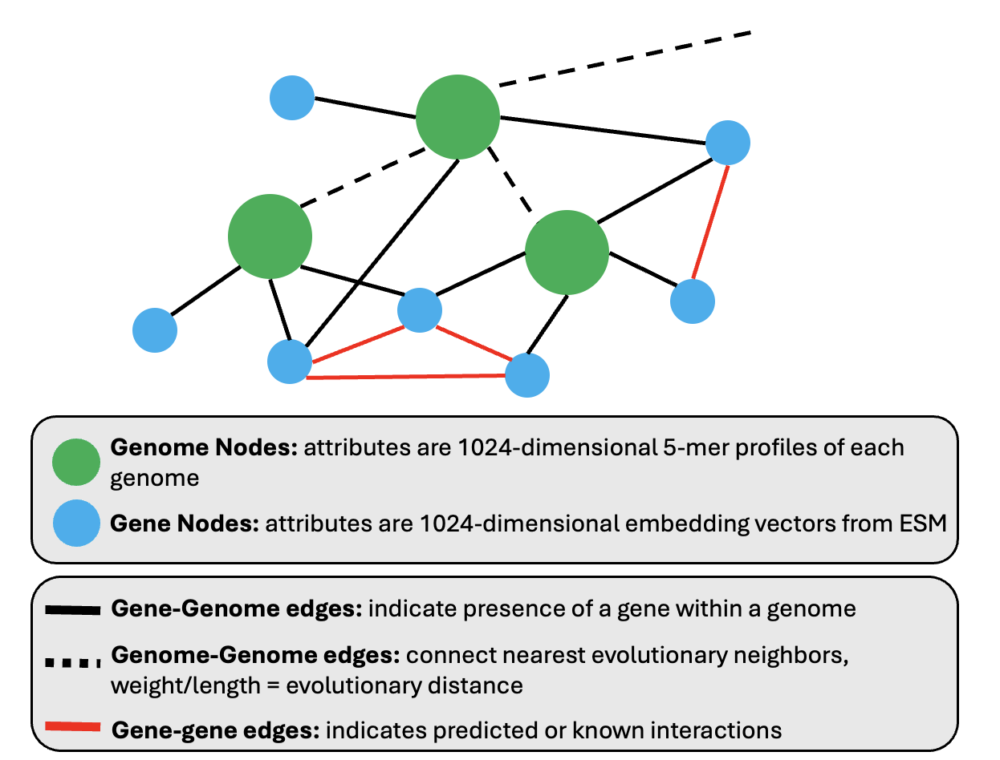

# Masked Graph Learning for Bacterial Genomes



Heterogeneous graph masked autoencoding for bacterial genomes, implementing [GraphMAE](https://arxiv.org/abs/2205.10803) extended to support both feature and structure reconstruction.

## Quick Start

Train a GraphMAE model on the genome-gene heterogeneous graph:

```bash
# Feature reconstruction (predict masked gene features)
python scripts/train_graphmae.py \
  --reconstruction_mode feature \
  --mask_gene_ratio 0.3 \
  --num_hidden 256 \
  --num_layers 2 \
  --max_epochs 100

# Structure reconstruction (predict masked edges)
python scripts/train_graphmae.py \
  --reconstruction_mode structure \
  --mask_edge_ratio 0.2 \
  --edge_decoder_type dot \
  --num_hidden 256 \
  --max_epochs 100

# Joint reconstruction (both features and structure)
python scripts/train_graphmae.py \
  --reconstruction_mode joint \
  --mask_gene_ratio 0.3 \
  --mask_edge_ratio 0.2 \
  --edge_loss_weight 1.0 \
  --num_hidden 256 \
  --max_epochs 100
```

See `data/README.md` for details on the graph data format and features.

## Source Components

**Graph Construction** (`src/GNN/`)
- `construct_het_graph.py` - Build heterogeneous graph with genome and gene nodes
- `construct_hom_graph.py` - Build homogeneous genome-only similarity graph
- `graph_masker.py` - Node and edge masking functions for self-supervised training

**Model Architecture**
- `encoder.py` - Heterogeneous GNN encoder (SAGE or GAT)
- `decoder.py` - Feature decoder for reconstructing masked node features
- `edge_decoder.py` - Edge decoder for reconstructing masked graph structure
- `model.py` - Complete GraphMAE model with three reconstruction modes
- `loss.py` - Loss functions (SCE, MSE) for feature reconstruction
